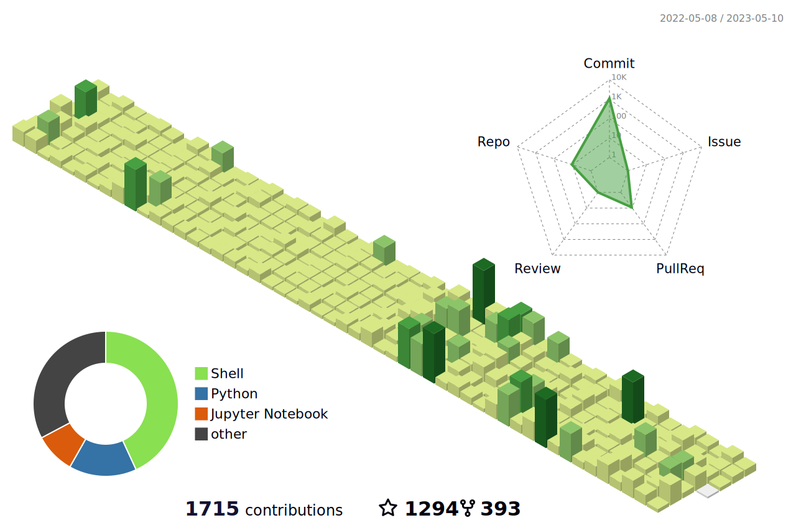

<!--  -->

<!-- <h1></h1> -->

<!-- <h1 align="center">Hi 👋, I'm yashvi jasoliya</h1> -->
<h1 align="center">
  <a href="https://github.com/yashvijasoliya"> 
   < yashvi jasoliya /> </a>
</h1>

<!-- 

  
    
 

     

  -->
 
<h3 align="center">|| A passionate Cyber security and Web developer from India ||</h3>
<!--   -->

 

  

 
  

<!-- 

- 🌱 I’m currently learning **Bachelor of Engineering.**

- 💬 Ask me about ** || C, C++, MYSQL, HTML, CSS, Data structures || **

- 📫 How to reach me **yashvijasoliya42@gmail.com**  

<!--    
 -->

<!--   -->

<h3>What if you like my work? 😃</h3>
<ul>
  <li>You can Star ⭐ the repositories you like.</li>
  <li>You can react ❤️ to my LinkedIn posts and connect 🤞 with me..</li>
</ul>

##  <h2 align="left">🌐 Socials: </h2>

  

# <h2 align="left">💻 Languages and Tools:  </h2>

 

 
 
 
   
 
 
 
 
  
 
   
 
 
   
 
 

 
   
 

 
 

                 

 

# <h2 align="left">📊 GitHub Status:</h2>

<!--   -->
  
<!--   -->
  
<!--  -->
<!-- -->  

<!--  -->

## 🏆 GitHub Trophies

## 🐦 Latest Tweet

    
